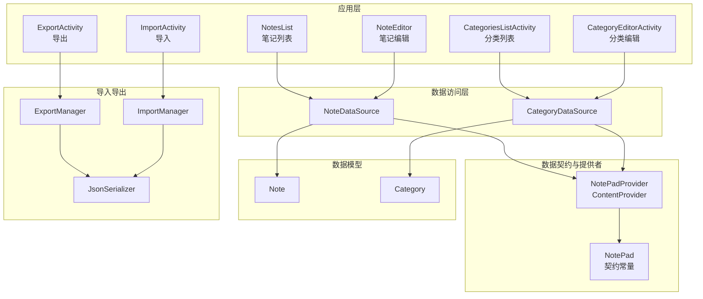
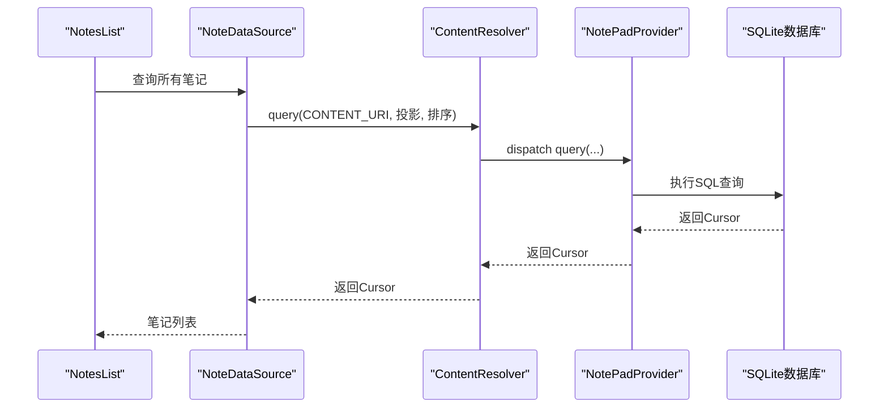
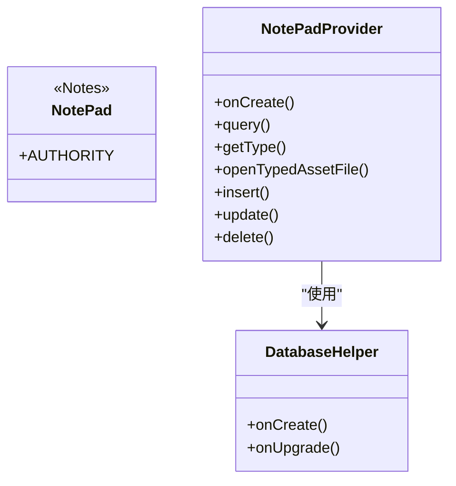
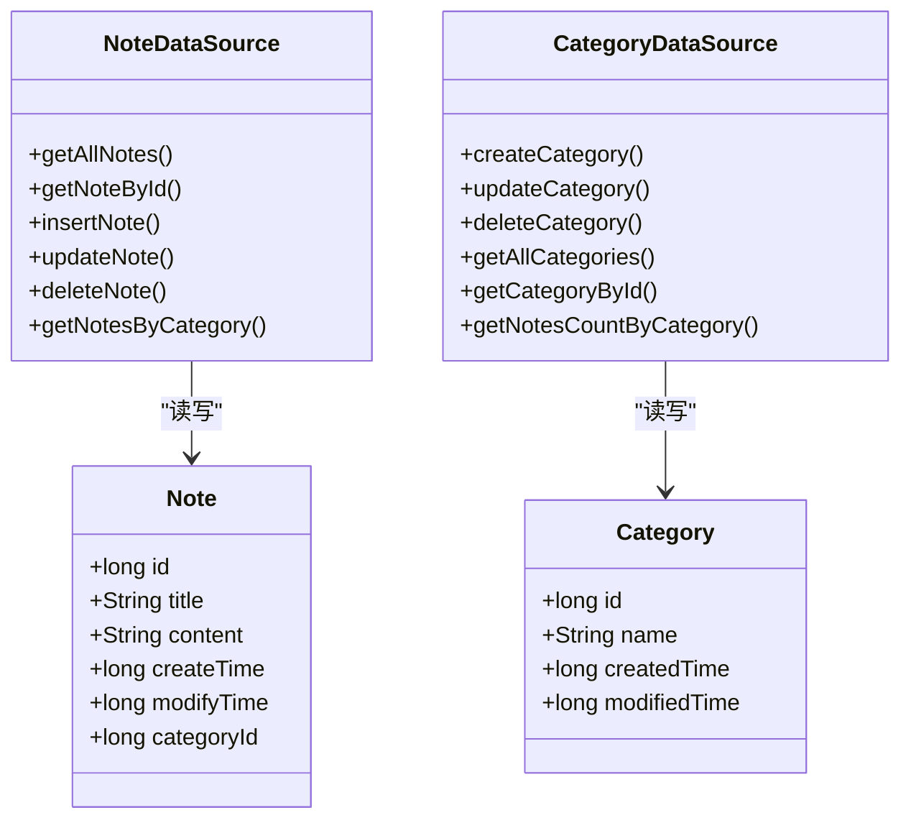
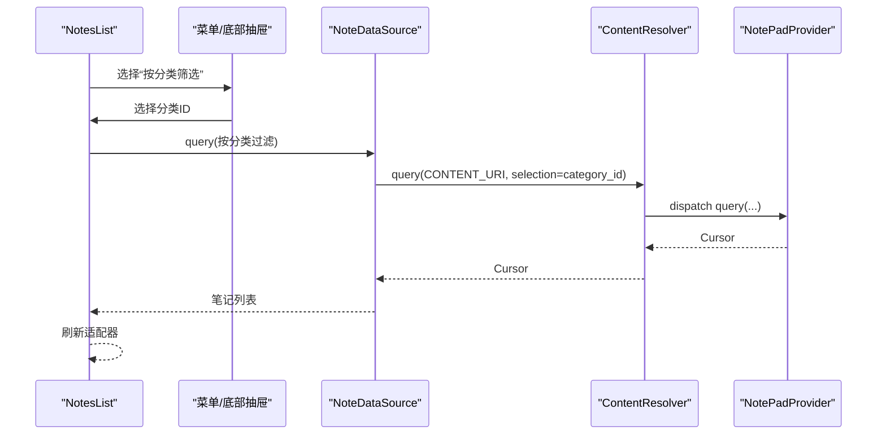
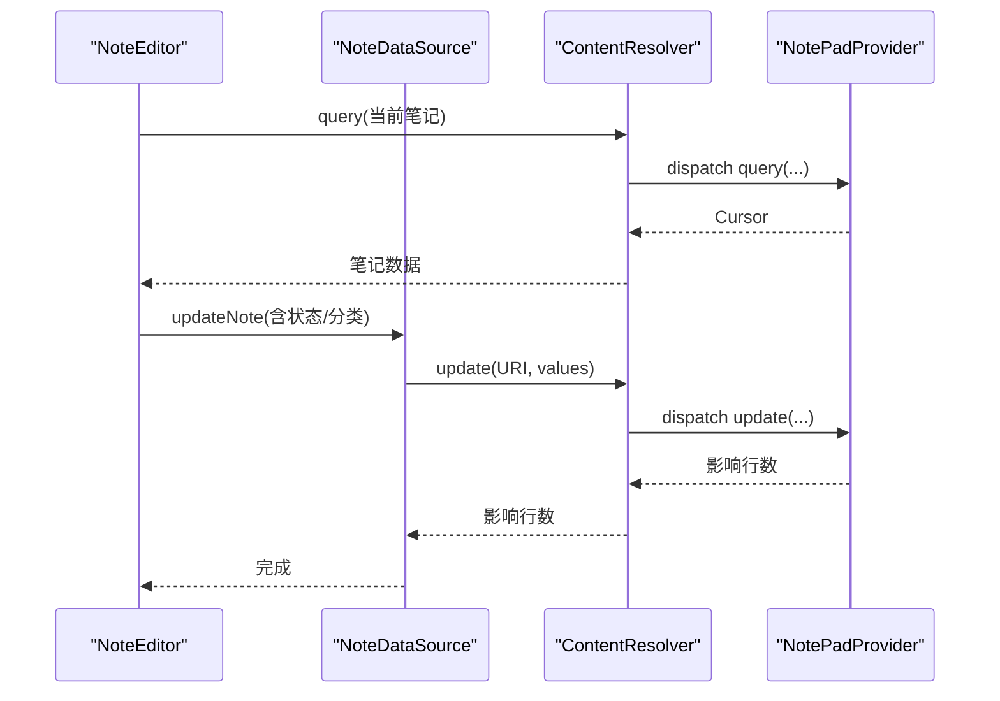
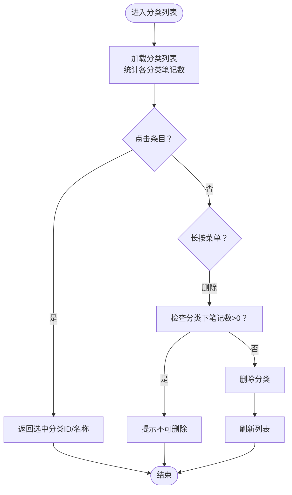
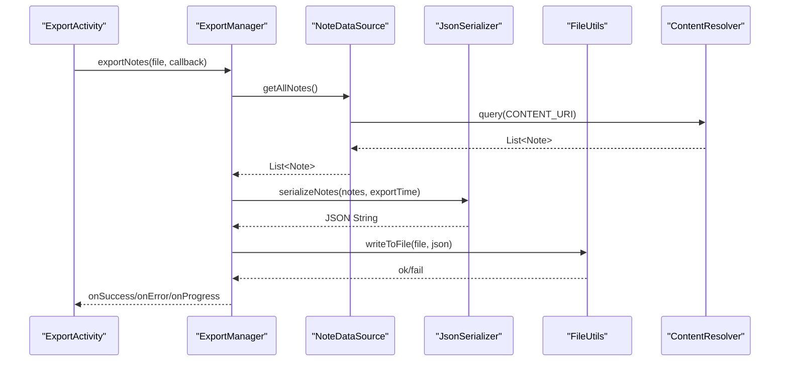
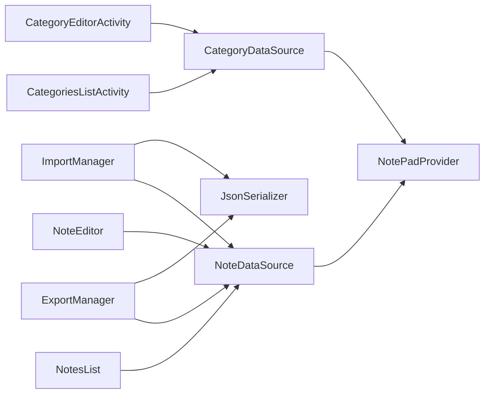

# 笔记分类系统

<cite>
**本文引用的文件**
- [NotePad.java](file://app/src/main/java/com/example/android/notepad/NotePad.java)
- [NotePadProvider.java](file://app/src/main/java/com/example/android/notepad/NotePadProvider.java)
- [Category.java](file://app/src/main/java/com/example/android/notepad/Category.java)
- [Note.java](file://app/src/main/java/com/example/android/notepad/Note.java)
- [CategoryDataSource.java](file://app/src/main/java/com/example/android/notepad/CategoryDataSource.java)
- [NoteDataSource.java](file://app/src/main/java/com/example/android/notepad/NoteDataSource.java)
- [NotesList.java](file://app/src/main/java/com/example/android/notepad/NotesList.java)
- [NoteEditor.java](file://app/src/main/java/com/example/android/notepad/NoteEditor.java)
- [CategoriesListActivity.java](file://app/src/main/java/com/example/android/notepad/CategoriesListActivity.java)
- [CategoryEditorActivity.java](file://app/src/main/java/com/example/android/notepad/CategoryEditorActivity.java)
- [JsonSerializer.java](file://app/src/main/java/com/example/android/notepad/JsonSerializer.java)
- [ExportManager.java](file://app/src/main/java/com/example/android/notepad/ExportManager.java)
- [ImportManager.java](file://app/src/main/java/com/example/android/notepad/ImportManager.java)
- [AndroidManifest.xml](file://app/src/main/AndroidManifest.xml)
- [README.md](file://README.md)
</cite>

## 目录
1. [简介](#简介)
2. [项目结构](#项目结构)
3. [核心组件](#核心组件)
4. [架构总览](#架构总览)
5. [详细组件分析](#详细组件分析)
6. [依赖关系分析](#依赖关系分析)
7. [性能与可用性考量](#性能与可用性考量)
8. [故障排查指南](#故障排查指南)
9. [结论](#结论)
10. [附录](#附录)

## 简介
本项目是一个基于 Android 的笔记管理应用，源自官方示例并扩展了分类管理与状态标记能力。系统采用 ContentProvider + SQLite 的数据访问模式，配合 Activity 层完成笔记与分类的增删改查、筛选、导入导出等功能。本文档面向开发者与产品人员，系统梳理架构、数据流与关键流程，并提供可视化图示与排障建议。

## 项目结构
- 应用包名：com.example.android.notepad
- 主要模块：
  - 数据契约与提供者：NotePad、NotePadProvider
  - 数据模型：Note、Category
  - 数据访问层：NoteDataSource、CategoryDataSource
  - UI 层：NotesList、NoteEditor、CategoriesListActivity、CategoryEditorActivity
  - 导入导出：JsonSerializer、ExportManager、ImportManager
  - 清单与权限：AndroidManifest.xml

图表来源
- [NotesList.java](file://app/src/main/java/com/example/android/notepad/NotesList.java#L1-L120)
- [NoteEditor.java](file://app/src/main/java/com/example/android/notepad/NoteEditor.java#L1-L120)
- [CategoriesListActivity.java](file://app/src/main/java/com/example/android/notepad/CategoriesListActivity.java#L1-L120)
- [CategoryEditorActivity.java](file://app/src/main/java/com/example/android/notepad/CategoryEditorActivity.java#L1-L120)
- [NoteDataSource.java](file://app/src/main/java/com/example/android/notepad/NoteDataSource.java#L1-L80)
- [CategoryDataSource.java](file://app/src/main/java/com/example/android/notepad/CategoryDataSource.java#L1-L80)
- [NotePad.java](file://app/src/main/java/com/example/android/notepad/NotePad.java#L1-L120)
- [NotePadProvider.java](file://app/src/main/java/com/example/android/notepad/NotePadProvider.java#L1-L120)
- [JsonSerializer.java](file://app/src/main/java/com/example/android/notepad/JsonSerializer.java#L1-L60)
- [ExportManager.java](file://app/src/main/java/com/example/android/notepad/ExportManager.java#L1-L60)
- [ImportManager.java](file://app/src/main/java/com/example/android/notepad/ImportManager.java#L1-L60)

章节来源
- [README.md](file://README.md#L1-L97)
- [AndroidManifest.xml](file://app/src/main/AndroidManifest.xml#L1-L133)

## 核心组件
- 数据契约 NotePad：定义 Authority、表名、列名、URI 模式、排序规则与 MIME 类型。
- ContentProvider NotePadProvider：实现 CRUD、URI 匹配、投影映射、Live Folder、流式输出等。
- 数据模型 Note/Category：承载笔记与分类实体属性及哈希/相等逻辑。
- 数据访问层 NoteDataSource/CategoryDataSource：封装 ContentResolver 查询与更新。
- UI 层 NotesList/NoteEditor：列表展示、筛选、上下文菜单、编辑、状态切换；分类管理界面。
- 导入导出 JsonSerializer/ExportManager/ImportManager：JSON 序列化与异步导入导出。

章节来源
- [NotePad.java](file://app/src/main/java/com/example/android/notepad/NotePad.java#L1-L280)
- [NotePadProvider.java](file://app/src/main/java/com/example/android/notepad/NotePadProvider.java#L1-L200)
- [Note.java](file://app/src/main/java/com/example/android/notepad/Note.java#L1-L137)
- [Category.java](file://app/src/main/java/com/example/android/notepad/Category.java#L1-L102)
- [NoteDataSource.java](file://app/src/main/java/com/example/android/notepad/NoteDataSource.java#L1-L209)
- [CategoryDataSource.java](file://app/src/main/java/com/example/android/notepad/CategoryDataSource.java#L1-L196)

## 架构总览
系统采用“契约-提供者-访问层-UI”的分层架构：
- 契约层：NotePad 定义 URI 与列名，保证客户端与提供者一致。
- 提供者层：NotePadProvider 实现 ContentProvider 接口，负责数据库创建/升级、URI 匹配、查询/插入/更新/删除、类型与流式输出。
- 访问层：NoteDataSource/CategoryDataSource 封装 ContentResolver 调用，屏蔽 URI 细节。
- UI 层：NotesList/NoteEditor/分类相关 Activity 负责交互与业务编排。
- 导入导出：JsonSerializer 负责 JSON 结构，ExportManager/ImportManager 负责异步 IO 与进度回调。

图表来源
- [NotesList.java](file://app/src/main/java/com/example/android/notepad/NotesList.java#L1-L120)
- [NoteDataSource.java](file://app/src/main/java/com/example/android/notepad/NoteDataSource.java#L1-L80)
- [NotePadProvider.java](file://app/src/main/java/com/example/android/notepad/NotePadProvider.java#L320-L430)

## 详细组件分析

### 数据契约与提供者
- NotePad
  - 定义 Authority、Notes 与 Categories 表的 URI 模式、列名、默认排序、MIME 类型。
  - 提供 Notes 的状态常量（待办/完成）。
- NotePadProvider
  - 数据库初始化与版本升级（含新增列与表）。
  - UriMatcher 匹配 NOTES、NOTE_ID、LIVE_FOLDER、TODO、NORMAL、CATEGORIES、CATEGORY_ID。
  - query：根据匹配结果选择投影映射、拼接 where 条件、设置排序、返回 Cursor 并注册通知。
  - getType/openTypedAssetFile：返回 MIME 类型与流式输出支持。
  - insert：填充默认值（标题、时间、状态、分类），插入后通知观察者。
  - update/delete：按 URI 匹配执行更新/删除。
  - 数据库结构：notes 表含标题、内容、创建/修改时间、状态、分类 ID；categories 表含名称、创建/修改时间。

图表来源
- [NotePad.java](file://app/src/main/java/com/example/android/notepad/NotePad.java#L1-L280)
- [NotePadProvider.java](file://app/src/main/java/com/example/android/notepad/NotePadProvider.java#L1-L304)

章节来源
- [NotePad.java](file://app/src/main/java/com/example/android/notepad/NotePad.java#L1-L280)
- [NotePadProvider.java](file://app/src/main/java/com/example/android/notepad/NotePadProvider.java#L1-L800)

### 数据模型与数据访问层
- Note/Category
  - 简单 POJO，包含 id、名称/标题、时间戳、分类 ID 等。
  - 提供 equals/hashCode/toString，便于集合比较与日志输出。
- NoteDataSource
  - 封装查询、插入、更新、删除、按分类过滤等方法。
  - 使用 NotePad.Notes 的列名与 URI 常量。
- CategoryDataSource
  - 封装分类的增删改查、按 ID 查询、统计某分类下笔记数量。

图表来源
- [Note.java](file://app/src/main/java/com/example/android/notepad/Note.java#L1-L137)
- [Category.java](file://app/src/main/java/com/example/android/notepad/Category.java#L1-L102)
- [NoteDataSource.java](file://app/src/main/java/com/example/android/notepad/NoteDataSource.java#L1-L209)
- [CategoryDataSource.java](file://app/src/main/java/com/example/android/notepad/CategoryDataSource.java#L1-L196)

章节来源
- [Note.java](file://app/src/main/java/com/example/android/notepad/Note.java#L1-L137)
- [Category.java](file://app/src/main/java/com/example/android/notepad/Category.java#L1-L102)
- [NoteDataSource.java](file://app/src/main/java/com/example/android/notepad/NoteDataSource.java#L1-L209)
- [CategoryDataSource.java](file://app/src/main/java/com/example/android/notepad/CategoryDataSource.java#L1-L196)

### UI 组件与交互流程

#### 笔记列表 NotesList
- 加载与展示
  - 使用 LoaderManager 异步加载数据，绑定自定义适配器，显示标题、修改时间、状态徽标与分类标签。
  - 初始化分类缓存，减少数据库查询次数。
- 过滤与筛选
  - 支持搜索框输入实时过滤。
  - 通过菜单提供“所有笔记”、“待办/普通”、“按分类筛选”等选项。
  - 底部抽屉式分类筛选面板，支持快速选择。
- 上下文菜单
  - 支持打开、删除、切换状态等操作。
- 导航
  - 通过 Intent.ACTION_ADD/INSERT/PASTE 启动 NoteEditor。

图表来源
- [NotesList.java](file://app/src/main/java/com/example/android/notepad/NotesList.java#L560-L760)
- [NoteDataSource.java](file://app/src/main/java/com/example/android/notepad/NoteDataSource.java#L166-L209)
- [NotePadProvider.java](file://app/src/main/java/com/example/android/notepad/NotePadProvider.java#L320-L430)

章节来源
- [NotesList.java](file://app/src/main/java/com/example/android/notepad/NotesList.java#L1-L966)

#### 笔记编辑 NoteEditor
- 生命周期与状态
  - 支持 ACTION_EDIT/ACTION_INSERT，插入时创建空记录并返回 URI。
  - onResume 重新查询数据，设置标题、内容、待办状态、分类下拉框。
- 分类与状态
  - 分类下拉框动态加载所有分类，支持“无分类”。
  - 待办状态与分类 ID 写回数据库。
- 菜单操作
  - 保存、删除、撤销、切换状态。

图表来源
- [NoteEditor.java](file://app/src/main/java/com/example/android/notepad/NoteEditor.java#L290-L520)
- [NoteDataSource.java](file://app/src/main/java/com/example/android/notepad/NoteDataSource.java#L124-L165)
- [NotePadProvider.java](file://app/src/main/java/com/example/android/notepad/NotePadProvider.java#L605-L737)

章节来源
- [NoteEditor.java](file://app/src/main/java/com/example/android/notepad/NoteEditor.java#L1-L705)

#### 分类管理 CategoriesListActivity 与 CategoryEditorActivity
- 分类列表
  - 展示所有分类与每个分类下的笔记数量；支持“所有笔记”快捷项。
  - 上下文菜单支持删除（需先清空分类内笔记）。
- 分类编辑
  - 插入/更新模式；校验名称唯一性；保存后返回刷新列表。

图表来源
- [CategoriesListActivity.java](file://app/src/main/java/com/example/android/notepad/CategoriesListActivity.java#L110-L230)
- [CategoryEditorActivity.java](file://app/src/main/java/com/example/android/notepad/CategoryEditorActivity.java#L110-L180)
- [CategoryDataSource.java](file://app/src/main/java/com/example/android/notepad/CategoryDataSource.java#L93-L196)

章节来源
- [CategoriesListActivity.java](file://app/src/main/java/com/example/android/notepad/CategoriesListActivity.java#L1-L257)
- [CategoryEditorActivity.java](file://app/src/main/java/com/example/android/notepad/CategoryEditorActivity.java#L1-L180)
- [CategoryDataSource.java](file://app/src/main/java/com/example/android/notepad/CategoryDataSource.java#L1-L196)

### 导入导出流程
- JsonSerializer
  - 将 Note 列表序列化为 JSON，包含版本号与导出时间；支持反序列化。
- ExportManager
  - 异步导出：查询所有笔记 -> JSON 序列化 -> 文件写入 -> 进度回调 -> 成功/失败。
- ImportManager
  - 异步导入：文件读取 -> JSON 反序列化 -> 去重/更新或插入 -> 进度回调 -> 成功/失败。

图表来源
- [ExportManager.java](file://app/src/main/java/com/example/android/notepad/ExportManager.java#L1-L258)
- [JsonSerializer.java](file://app/src/main/java/com/example/android/notepad/JsonSerializer.java#L1-L121)
- [NoteDataSource.java](file://app/src/main/java/com/example/android/notepad/NoteDataSource.java#L1-L80)

章节来源
- [ExportManager.java](file://app/src/main/java/com/example/android/notepad/ExportManager.java#L1-L258)
- [ImportManager.java](file://app/src/main/java/com/example/android/notepad/ImportManager.java#L1-L194)
- [JsonSerializer.java](file://app/src/main/java/com/example/android/notepad/JsonSerializer.java#L1-L121)

## 依赖关系分析
- 组件耦合
  - UI 层仅依赖数据访问层，数据访问层依赖 ContentResolver 与 NotePad 常量，提供者负责底层数据库。
  - 导入导出模块与 UI 解耦，通过回调驱动进度与结果。
- 外部依赖
  - Android 框架：ContentProvider、LoaderManager、AsyncTask、Intent、Menu、Cursor 等。
  - JSON 库：org.json（用于序列化/反序列化）。
- 潜在循环依赖
  - 未发现直接循环依赖；数据访问层通过契约常量与提供者间接交互。

图表来源
- [NotesList.java](file://app/src/main/java/com/example/android/notepad/NotesList.java#L1-L120)
- [NoteEditor.java](file://app/src/main/java/com/example/android/notepad/NoteEditor.java#L1-L120)
- [CategoriesListActivity.java](file://app/src/main/java/com/example/android/notepad/CategoriesListActivity.java#L1-L120)
- [CategoryEditorActivity.java](file://app/src/main/java/com/example/android/notepad/CategoryEditorActivity.java#L1-L120)
- [NoteDataSource.java](file://app/src/main/java/com/example/android/notepad/NoteDataSource.java#L1-L80)
- [CategoryDataSource.java](file://app/src/main/java/com/example/android/notepad/CategoryDataSource.java#L1-L80)
- [ExportManager.java](file://app/src/main/java/com/example/android/notepad/ExportManager.java#L1-L80)
- [ImportManager.java](file://app/src/main/java/com/example/android/notepad/ImportManager.java#L1-L80)
- [JsonSerializer.java](file://app/src/main/java/com/example/android/notepad/JsonSerializer.java#L1-L60)

章节来源
- [AndroidManifest.xml](file://app/src/main/AndroidManifest.xml#L1-L133)

## 性能与可用性考量
- 查询性能
  - 使用 LoaderManager 异步加载，避免主线程阻塞。
  - NotesList 对分类名称进行缓存，减少数据库查询。
- 数据一致性
  - Provider 在插入/更新时填充默认值，避免空字段导致的异常。
  - 分类删除前检查非空，防止破坏数据完整性。
- 导入导出
  - 异步任务与进度回调，避免 UI 卡顿。
  - 文件写入后进行基础验证（存在性、大小），失败时清理残留文件。
- 兼容性
  - 使用 AppCompat 与 Material 组件，适配多版本 Android。

[本节为通用指导，无需列出具体文件来源]

## 故障排查指南
- 笔记列表空白
  - 检查 Loader 是否初始化成功，确认 URI 与投影正确。
  - 参考：[NotesList.java](file://app/src/main/java/com/example/android/notepad/NotesList.java#L270-L320)
- 分类删除失败
  - 确认分类下无笔记；查看 CategoryDataSource 的删除逻辑。
  - 参考：[CategoriesListActivity.java](file://app/src/main/java/com/example/android/notepad/CategoriesListActivity.java#L208-L230)
- 导出失败
  - 检查目录可写、文件大小合理性；查看 ExportManager 的验证逻辑。
  - 参考：[ExportManager.java](file://app/src/main/java/com/example/android/notepad/ExportManager.java#L120-L210)
- 导入异常
  - 检查 JSON 格式与版本；查看 ImportManager 的解析与去重策略。
  - 参考：[ImportManager.java](file://app/src/main/java/com/example/android/notepad/ImportManager.java#L80-L130)
- Provider 异常
  - 检查 UriMatcher 匹配与 getType/openTypedAssetFile 返回值。
  - 参考：[NotePadProvider.java](file://app/src/main/java/com/example/android/notepad/NotePadProvider.java#L432-L571)

章节来源
- [NotesList.java](file://app/src/main/java/com/example/android/notepad/NotesList.java#L270-L320)
- [CategoriesListActivity.java](file://app/src/main/java/com/example/android/notepad/CategoriesListActivity.java#L208-L230)
- [ExportManager.java](file://app/src/main/java/com/example/android/notepad/ExportManager.java#L120-L210)
- [ImportManager.java](file://app/src/main/java/com/example/android/notepad/ImportManager.java#L80-L130)
- [NotePadProvider.java](file://app/src/main/java/com/example/android/notepad/NotePadProvider.java#L432-L571)

## 结论
本系统以清晰的分层架构实现了笔记与分类管理的核心能力，结合 ContentProvider 与数据访问层，提供了稳定的数据一致性与良好的扩展性。UI 层通过异步加载与缓存优化提升了用户体验；导入导出模块支持 JSON 格式，便于跨设备迁移。后续可在以下方面进一步增强：引入 Room/Repository 模式以降低耦合、完善单元测试覆盖、优化导入去重策略与冲突处理。

[本节为总结性内容，无需列出具体文件来源]

## 附录
- 权限与清单
  - 读写外部存储权限声明。
  - Provider 与 Activity 的 Intent Filter 与 MIME 类型配置。
- 版本与兼容性
  - 最低 API 23，目标 API 34，使用 AppCompat 保持兼容。

章节来源
- [AndroidManifest.xml](file://app/src/main/AndroidManifest.xml#L1-L133)
- [README.md](file://README.md#L1-L97)