# 测试

<cite>
**本文档中引用的文件**
- [NotePadActivityTest.java](file://app/src/androidTest/java/com/example/android/notepad/NotePadActivityTest.java)
- [NotePadProviderTest.java](file://app/src/androidTest/java/com/example/android/notepad/NotePadProviderTest.java)
- [build.gradle](file://app/build.gradle)
- [AndroidManifest.xml](file://app/src/main/AndroidManifest.xml)
</cite>

## 目录
1. [简介](#简介)
2. [测试架构概述](#测试架构概述)
3. [Activity测试 - NotePadActivityTest](#activity测试---notepadactivitytest)
4. [Content Provider测试 - NotePadProviderTest](#content-provider测试---notepadprovidertest)
5. [测试框架和配置](#测试框架和配置)
6. [测试设计原则](#测试设计原则)
7. [测试执行指南](#测试执行指南)
8. [最佳实践和建议](#最佳实践和建议)
9. [总结](#总结)

## 简介

NotePad应用包含了一套完整的测试套件，展示了Android应用程序测试的最佳实践。这套测试系统分为两个主要类别，分别针对不同的应用层次进行验证：

- **NotePadActivityTest**：专注于验证Activity层的功能，确保用户界面组件按预期工作
- **NotePadProviderTest**：专门测试数据层，验证Content Provider的CRUD操作和数据库交互

这些测试不仅为当前功能提供了质量保证，还为未来的功能扩展和维护奠定了坚实的基础。

## 测试架构概述

NotePad应用的测试架构采用了分层测试策略，每个测试类都专注于特定的应用组件：

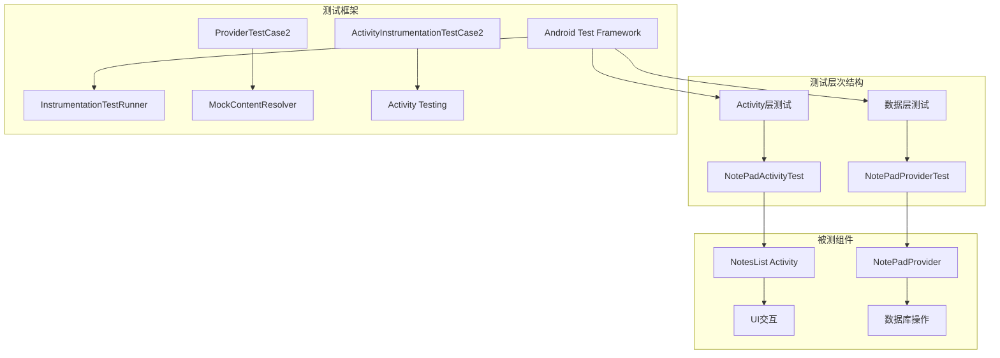

**图表来源**
- [NotePadActivityTest.java](file://app/src/androidTest/java/com/example/android/notepad/NotePadActivityTest.java#L26-L41)
- [NotePadProviderTest.java](file://app/src/androidTest/java/com/example/android/notepad/NotePadProviderTest.java#L45-L102)

## Activity测试 - NotePadActivityTest

### 测试目标和范围

NotePadActivityTest专注于验证应用的主要Activity（NotesList）的行为和生命周期管理。这个测试类展示了如何使用Android Instrumentation框架来验证Activity的启动和基本功能。

### 核心测试功能

该测试类的核心功能相对简单但重要：

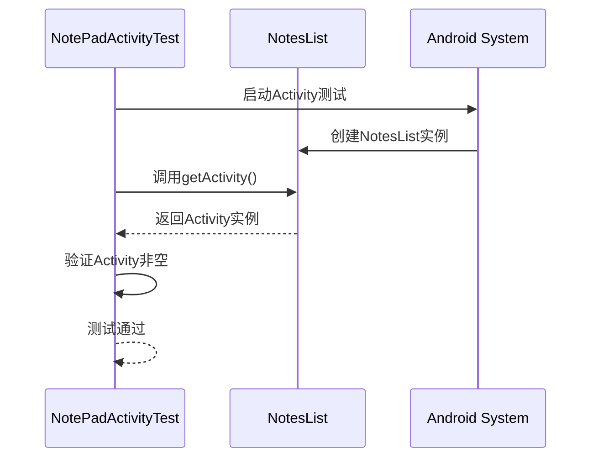

**图表来源**
- [NotePadActivityTest.java](file://app/src/androidTest/java/com/example/android/notepad/NotePadActivityTest.java#L38-L40)

### 测试实现特点

1. **继承关系**：继承自`ActivityInstrumentationTestCase2<NotesList>`
2. **构造函数**：指定要测试的目标Activity类型
3. **测试方法**：验证Activity实例的有效性

### 应用价值

虽然这个测试看起来简单，但它建立了以下重要的测试基础：
- 确保Activity能够正常启动
- 验证测试环境配置正确
- 为更复杂的Activity测试提供模板

**章节来源**
- [NotePadActivityTest.java](file://app/src/androidTest/java/com/example/android/notepad/NotePadActivityTest.java#L1-L42)

## Content Provider测试 - NotePadProviderTest

### 测试架构和设计

NotePadProviderTest是一个全面的数据层测试套件，展示了如何使用Android的ProviderTestCase2框架来测试Content Provider。这个测试类包含了对Provider所有核心功能的详尽验证。

### 测试覆盖范围

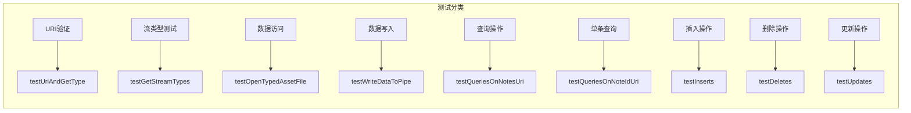

**图表来源**
- [NotePadProviderTest.java](file://app/src/androidTest/java/com/example/android/notepad/NotePadProviderTest.java#L163-L839)

### 核心测试方法详解

#### 1. URI和MIME类型测试
验证Provider支持的URI模式和相应的MIME类型：

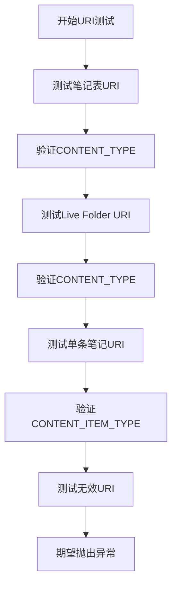

**图表来源**
- [NotePadProviderTest.java](file://app/src/androidTest/java/com/example/android/notepad/NotePadProviderTest.java#L163-L181)

#### 2. 数据查询测试
涵盖不同类型的查询场景：

| 查询类型 | 测试方法 | 验证内容 |
|---------|---------|---------|
| 全表查询 | testQueriesOnNotesUri | 基本查询、投影、选择条件、排序 |
| 单条记录查询 | testQueriesOnNoteIdUri | URI匹配、记录唯一性 |
| 条件查询 | testQueriesOnNotesUri | 复杂选择条件、参数绑定 |

#### 3. CRUD操作测试
完整的数据操作验证：

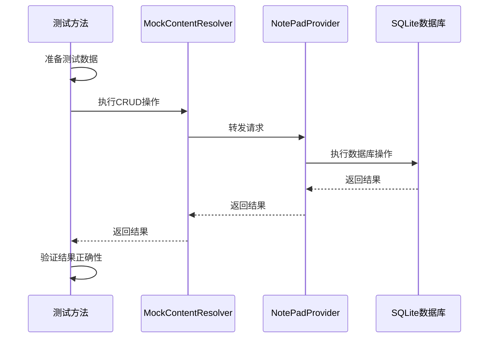

**图表来源**
- [NotePadProviderTest.java](file://app/src/androidTest/java/com/example/android/notepad/NotePadProviderTest.java#L618-L839)

### 测试数据管理

测试使用了一个精心设计的测试数据管理系统：

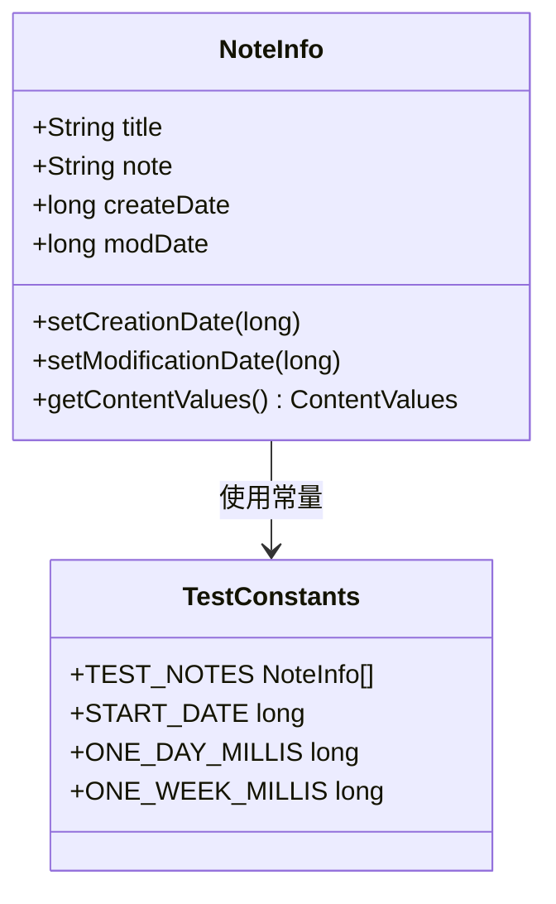

**图表来源**
- [NotePadProviderTest.java](file://app/src/androidTest/java/com/example/android/notepad/NotePadProviderTest.java#L789-L839)

### 异常处理测试

测试涵盖了各种异常情况：

1. **无效URI处理**：验证Provider正确拒绝不支持的URI
2. **权限验证**：确保正确的MIME类型过滤
3. **资源清理**：测试文件描述符的正确关闭

**章节来源**
- [NotePadProviderTest.java](file://app/src/androidTest/java/com/example/android/notepad/NotePadProviderTest.java#L1-L840)

## 测试框架和配置

### Android测试框架

NotePad应用使用了Android官方的测试框架，具体包括：

#### 1. InstrumentationTestRunner配置

在build.gradle中配置了测试运行器：

```gradle
testInstrumentationRunner "android.test.InstrumentationTestRunner"
```

这个配置指定了使用传统的Android Instrumentation测试框架，适用于需要与Android系统交互的测试。

#### 2. 测试应用标识

```gradle
testApplicationId "com.example.android.notepad.tests"
```

这定义了测试应用的包名，与主应用分离，避免冲突。

### 构建配置

测试相关的构建配置确保了测试环境的正确设置：

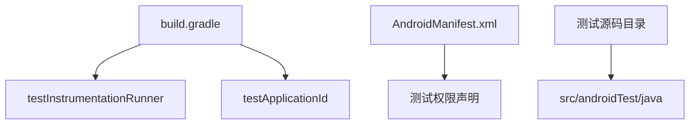

**图表来源**
- [build.gradle](file://app/build.gradle#L13-L14)

### 测试环境准备

测试框架提供了必要的基础设施：

1. **Mock对象**：使用MockContentResolver模拟ContentProvider
2. **数据库隔离**：每个测试都有独立的数据库实例
3. **生命周期管理**：自动处理测试前后的设置和清理

**章节来源**
- [build.gradle](file://app/build.gradle#L1-L24)

## 测试设计原则

### 分层测试策略

NotePad应用的测试体现了清晰的分层设计：

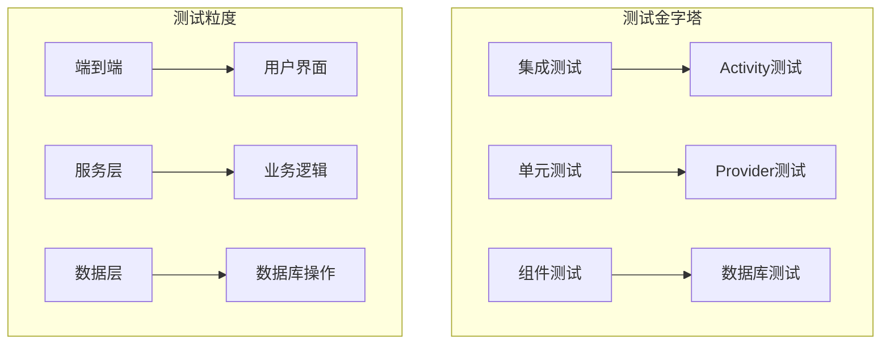

### 测试隔离原则

每个测试都遵循隔离原则：

1. **独立性**：测试之间不相互依赖
2. **可重复性**：相同的输入总是产生相同的结果
3. **确定性**：测试结果是确定的，没有随机性

### 数据驱动测试

测试使用了数据驱动的方法：

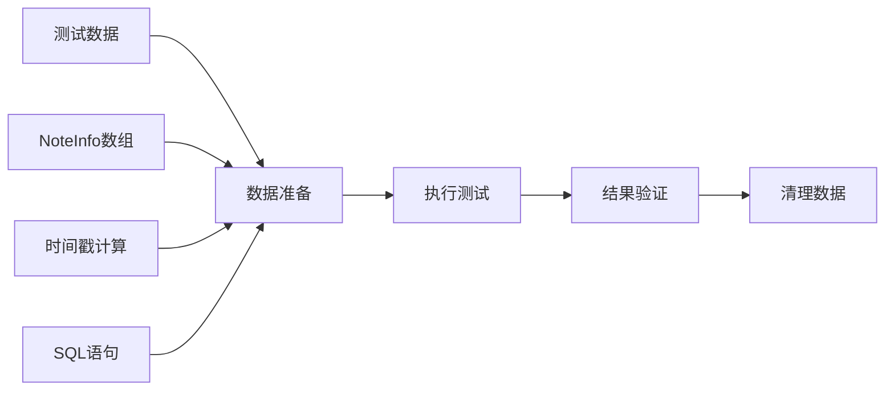

**图表来源**
- [NotePadProviderTest.java](file://app/src/androidTest/java/com/example/android/notepad/NotePadProviderTest.java#L58-L839)

## 测试执行指南

### 运行测试的步骤

1. **确保设备连接**：测试需要Android设备或模拟器
2. **安装测试应用**：构建时会自动安装测试APK
3. **执行测试**：可以通过IDE或命令行运行

### 测试输出解读

测试框架提供了详细的输出信息：

- **成功测试**：绿色标记，表示测试通过
- **失败测试**：红色标记，显示具体的失败原因
- **错误测试**：异常堆栈跟踪，帮助定位问题

### 性能考虑

测试设计考虑了性能因素：

1. **数据库隔离**：每个测试使用独立的数据库
2. **资源管理**：及时释放测试资源
3. **批量操作**：使用批量插入提高效率

## 最佳实践和建议

### 测试编写指导

基于NotePad应用的测试经验，以下是编写Android测试的最佳实践：

#### 1. Activity测试最佳实践

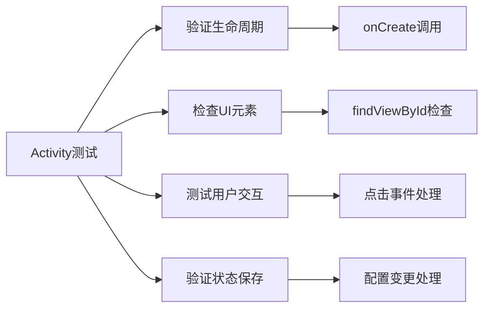

#### 2. Content Provider测试最佳实践

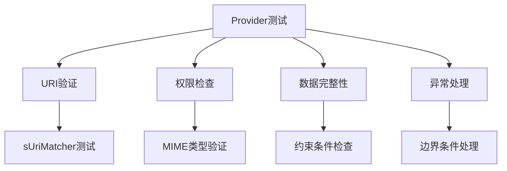

#### 3. 测试维护建议

1. **定期更新测试**：随着应用功能变化更新测试
2. **保持测试简洁**：避免过度复杂的测试逻辑
3. **文档化测试**：为复杂测试添加注释说明
4. **监控测试覆盖率**：确保关键功能得到充分测试

### 故障排除指南

常见测试问题及解决方案：

| 问题类型 | 可能原因 | 解决方案 |
|---------|---------|---------|
| 测试失败 | 数据库版本不匹配 | 更新数据库升级脚本 |
| 内存泄漏 | 资源未正确释放 | 检查测试中的资源清理 |
| 性能问题 | 测试数据过多 | 优化测试数据规模 |
| 平台差异 | API版本兼容性 | 添加版本检查逻辑 |

## 总结

NotePad应用的测试套件展示了Android应用程序测试的完整性和实用性。通过这两个主要测试类，开发者可以：

### 学习要点

1. **Activity测试**：展示了如何验证用户界面组件的基本功能
2. **Content Provider测试**：演示了数据层测试的全面性
3. **测试框架使用**：介绍了Android官方测试工具的正确使用方法

### 实际价值

- **质量保证**：确保现有功能的稳定性
- **开发指导**：为新功能测试提供参考模板
- **维护基础**：为未来的代码修改提供安全保障

### 发展方向

这套测试系统为进一步的质量改进提供了良好的起点：

1. **扩展测试覆盖**：增加更多边缘情况的测试
2. **自动化集成**：与CI/CD流水线集成
3. **性能测试**：添加性能基准测试
4. **用户体验测试**：引入UI自动化测试

通过参考NotePad应用的测试实现，开发者可以建立起对Android应用测试的深入理解，为构建高质量的Android应用程序奠定坚实基础。