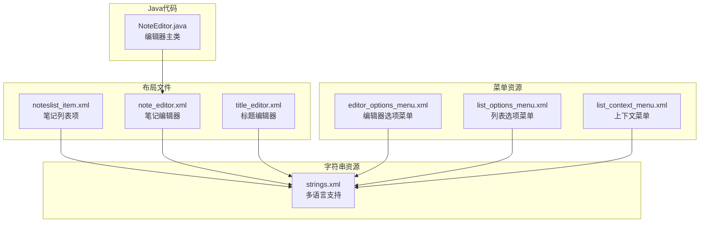
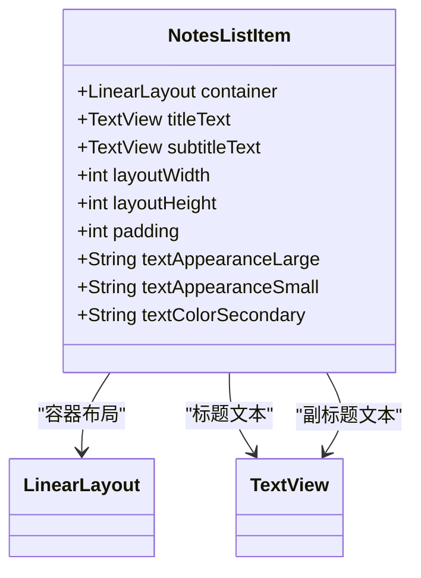
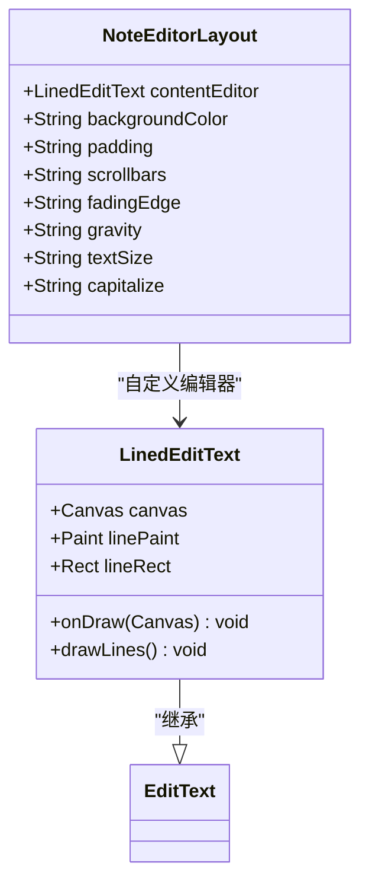
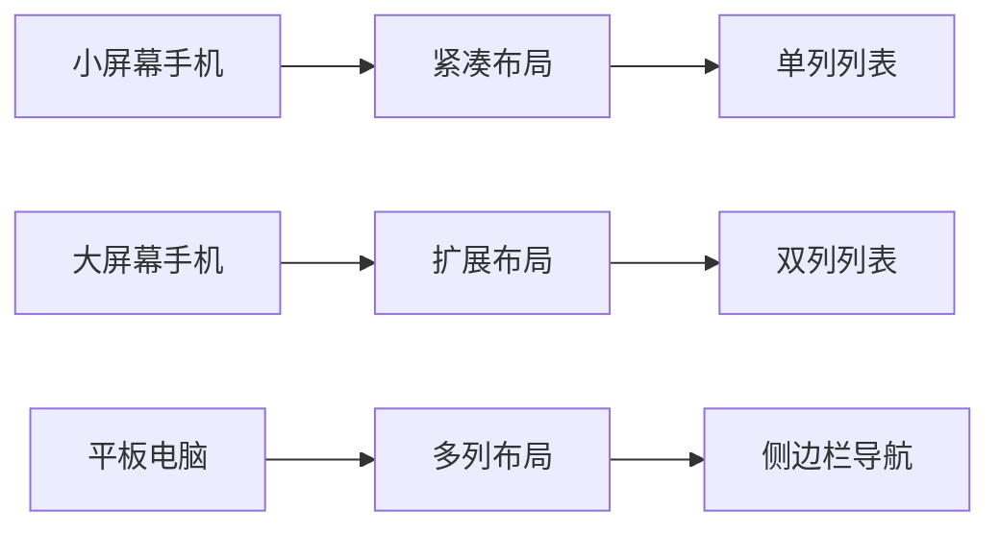

# 用户界面

<cite>
**本文档中引用的文件**
- [noteslist_item.xml](file://app/src/main/res/layout/noteslist_item.xml)
- [note_editor.xml](file://app/src/main/res/layout/note_editor.xml)
- [title_editor.xml](file://app/src/main/res/layout/title_editor.xml)
- [strings.xml](file://app/src/main/res/values/strings.xml)
- [editor_options_menu.xml](file://app/src/main/res/menu/editor_options_menu.xml)
- [list_options_menu.xml](file://app/src/main/res/menu/list_options_menu.xml)
- [list_context_menu.xml](file://app/src/main/res/menu/list_context_menu.xml)
- [NoteEditor.java](file://app/src/main/java/com/example/android/notepad/NoteEditor.java)
- [AndroidManifest.xml](file://app/src/main/AndroidManifest.xml)
</cite>

## 目录
1. [简介](#简介)
2. [项目结构概览](#项目结构概览)
3. [核心布局文件分析](#核心布局文件分析)
4. [字符串资源管理](#字符串资源管理)
5. [菜单系统](#菜单系统)
6. [应用主题与视觉风格](#应用主题与视觉风格)
7. [UI设计原则与最佳实践](#ui设计原则与最佳实践)
8. [响应式设计实现](#响应式设计实现)
9. [用户体验优化](#用户体验优化)
10. [总结](#总结)

## 简介

NotePad应用采用了简洁而功能明确的用户界面设计，主要包含两个核心界面：笔记列表界面和笔记编辑界面。该应用严格遵循Android的设计规范，使用Material Design元素和Holo主题，为用户提供直观且一致的操作体验。

## 项目结构概览

NotePad应用的用户界面组件组织清晰，主要分为以下几个部分：



**图表来源**
- [noteslist_item.xml](file://app/src/main/res/layout/noteslist_item.xml#L1-L40)
- [note_editor.xml](file://app/src/main/res/layout/note_editor.xml#L1-L29)
- [title_editor.xml](file://app/src/main/res/layout/title_editor.xml#L1-L44)

**章节来源**
- [strings.xml](file://app/src/main/res/values/strings.xml#L1-L43)
- [AndroidManifest.xml](file://app/src/main/AndroidManifest.xml#L1-L119)

## 核心布局文件分析

### 笔记列表项布局 (noteslist_item.xml)

笔记列表项是应用中最基础的UI组件，负责在ListView中显示每个笔记的基本信息。



**图表来源**
- [noteslist_item.xml](file://app/src/main/res/layout/noteslist_item.xml#L17-L40)

#### 布局特性分析

1. **容器结构**：采用垂直方向的LinearLayout作为根容器
2. **高度设置**：使用`?android:attr/listPreferredItemHeight`确保标准列表项高度
3. **文本配置**：
   - 标题使用大型文本外观和单行显示
   - 副标题使用小型文本外观和次要文本颜色
4. **间距处理**：左侧内边距5dp提供视觉分隔

**章节来源**
- [noteslist_item.xml](file://app/src/main/res/layout/noteslist_item.xml#L17-L40)

### 笔记编辑器布局 (note_editor.xml)

笔记编辑器是应用的核心交互界面，提供了完整的笔记编辑功能。



**图表来源**
- [note_editor.xml](file://app/src/main/res/layout/note_editor.xml#L16-L28)
- [NoteEditor.java](file://app/src/main/java/com/example/android/notepad/NoteEditor.java#L83-L134)

#### 编辑器特性

1. **自定义控件**：使用`LinedEditText`类提供网格线显示功能
2. **透明背景**：`@android:color/transparent`确保编辑器与主题融合
3. **滚动支持**：垂直滚动条和渐隐边缘效果
4. **文本格式**：大字体、句子首字母大写、顶部对齐

**章节来源**
- [note_editor.xml](file://app/src/main/res/layout/note_editor.xml#L16-L28)
- [NoteEditor.java](file://app/src/main/java/com/example/android/notepad/NoteEditor.java#L83-L134)

### 标题编辑器布局 (title_editor.xml)

标题编辑器专门用于编辑笔记标题，采用对话框形式呈现。

#### 布局特点

1. **垂直排列**：标题输入框和确认按钮垂直堆叠
2. **适配宽度**：使用`wrap_content`自动调整宽度
3. **内边距**：合理的内边距确保良好的触摸体验
4. **按钮对齐**：右对齐的确认按钮符合用户习惯

**章节来源**
- [title_editor.xml](file://app/src/main/res/layout/title_editor.xml#L17-L44)

## 字符串资源管理

应用通过`strings.xml`文件实现了完整的本地化支持，所有文本内容都集中管理。

### 主要字符串分类

| 字符串类别 | 示例键名 | 描述 |
|------------|----------|------|
| 应用基本信息 | `app_name`, `live_folder_name` | 应用名称和文件夹名称 |
| 标题相关 | `title_edit_title`, `title_create`, `title_edit` | 标题编辑相关的文本 |
| 菜单操作 | `menu_add`, `menu_save`, `menu_delete` | 各种操作菜单的标签 |
| 按钮文本 | `button_ok`, `text_title` | 按钮和标签文本 |
| 错误提示 | `error_title`, `error_message` | 错误信息和提示 |

### 国际化优势

1. **集中管理**：所有文本内容统一存储，便于维护
2. **动态切换**：支持运行时语言切换
3. **格式化支持**：使用参数化字符串处理动态内容
4. **可访问性**：为屏幕阅读器提供更好的支持

**章节来源**
- [strings.xml](file://app/src/main/res/values/strings.xml#L17-L43)

## 菜单系统

应用的菜单系统分为三个层次，分别服务于不同的使用场景。

### 编辑器选项菜单 (editor_options_menu.xml)

编辑器界面的主要操作菜单，包含保存、撤销和删除功能。

```mermaid
flowchart TD
A[编辑器选项菜单] --> B[保存操作]
A --> C[撤销操作]
A --> D[删除操作]
B --> E[图标: ic_menu_save]
B --> F[快捷键: S]
B --> G[显示方式: ifRoom|withText]
C --> H[图标: ic_menu_revert]
C --> I[条件显示: 内容变更时]
D --> J[图标: ic_menu_delete]
D --> K[显示方式: ifRoom|withText]
```

**图表来源**
- [editor_options_menu.xml](file://app/src/main/res/menu/editor_options_menu.xml#L2-L14)

### 列表选项菜单 (list_options_menu.xml)

笔记列表界面的全局操作菜单，提供新建、搜索和粘贴功能。

#### 功能特性

1. **新建笔记**：始终显示的新建按钮
2. **搜索功能**：集成SearchView的搜索入口
3. **粘贴操作**：基于剪贴板状态的智能显示

### 上下文菜单 (list_context_menu.xml)

长按笔记时出现的局部操作菜单。

#### 可用操作

1. **打开笔记**：直接进入编辑模式
2. **复制笔记**：复制到剪贴板
3. **删除笔记**：永久移除笔记

**章节来源**
- [editor_options_menu.xml](file://app/src/main/res/menu/editor_options_menu.xml#L2-L14)
- [list_options_menu.xml](file://app/src/main/res/menu/list_options_menu.xml#L2-L23)
- [list_context_menu.xml](file://app/src/main/res/menu/list_context_menu.xml#L2-L9)

## 应用主题与视觉风格

### 主题配置

应用采用了Android Holo Light主题，通过`AndroidManifest.xml`中的主题声明实现：

```xml
<activity android:name="NoteEditor"
    android:theme="@android:style/Theme.Holo.Light"
    android:screenOrientation="sensor"
    android:configChanges="keyboardHidden|orientation" />
```

### 视觉设计特征

1. **色彩方案**：浅色背景搭配深色文字
2. **图标风格**：采用Android标准图标集
3. **字体选择**：清晰易读的系统字体
4. **间距规则**：遵循Android设计指南的间距标准

### 设计一致性

- **导航栏**：保持一致的标题和操作按钮
- **按钮样式**：统一的按钮外观和交互反馈
- **列表样式**：标准的列表项布局和状态指示

**章节来源**
- [AndroidManifest.xml](file://app/src/main/AndroidManifest.xml#L53-L57)

## UI设计原则与最佳实践

### 响应式设计原则

1. **自适应布局**：使用`match_parent`和`wrap_content`确保布局适应不同屏幕尺寸
2. **弹性间距**：采用dp单位确保在不同密度屏幕上的一致性
3. **方向支持**：支持横竖屏切换而不影响用户体验

### 交互设计规范

1. **手势支持**：支持滑动、点击等基本手势
2. **反馈机制**：提供即时的视觉和触觉反馈
3. **错误处理**：友好的错误提示和恢复机制

### 性能优化

1. **延迟加载**：仅在需要时加载额外资源
2. **内存管理**：及时释放不需要的UI资源
3. **渲染优化**：避免复杂的布局嵌套

## 响应式设计实现

### 屏幕适配策略



### 布局参数优化

1. **宽度控制**：使用`match_parent`确保填满可用空间
2. **高度适配**：`?android:attr/listPreferredItemHeight`提供标准高度
3. **内边距**：dp单位确保在不同设备上的一致性

### 导航适配

- **底部导航**：适合小屏幕的底部导航栏
- **侧边导航**：适合大屏幕的侧边栏设计
- **浮动操作按钮**：适用于主要操作的快速访问

## 用户体验优化

### 输入体验

1. **键盘适配**：智能键盘弹出和隐藏
2. **文本格式**：自动首字母大写和句末标点
3. **编辑辅助**：网格线帮助用户更好地组织内容

### 导航体验

1. **层级清晰**：明确的父子关系导航
2. **返回便捷**：一键返回上级界面
3. **状态保持**：界面状态在旋转后保持不变

### 性能体验

1. **加载速度**：快速的界面响应
2. **动画流畅**：平滑的过渡动画
3. **资源占用**：合理的内存和CPU使用

## 总结

NotePad应用的用户界面设计体现了以下核心特点：

1. **简洁性**：去除不必要的装饰，专注于核心功能
2. **一致性**：统一的设计语言和交互模式
3. **可用性**：直观的操作流程和清晰的视觉层次
4. **可访问性**：良好的可读性和交互支持
5. **性能**：高效的资源利用和流畅的用户体验

该应用的UI设计充分考虑了Android平台的特点和用户需求，为开发者提供了优秀的参考案例。通过合理使用XML布局文件、字符串资源管理和菜单系统，实现了既美观又实用的用户界面。