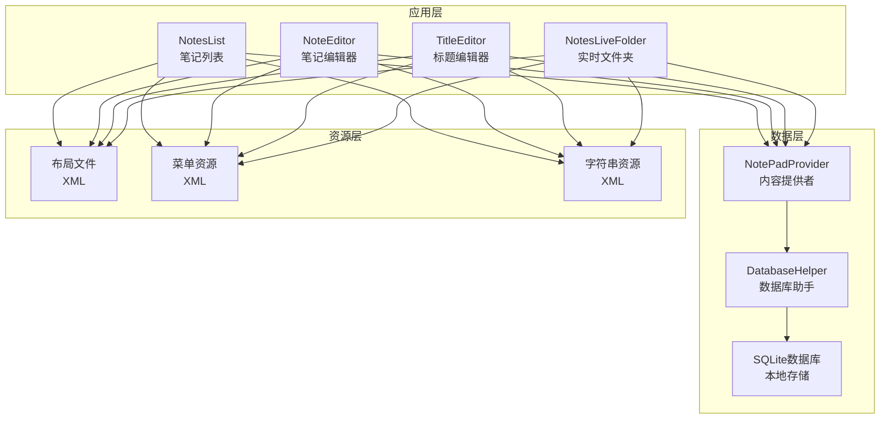
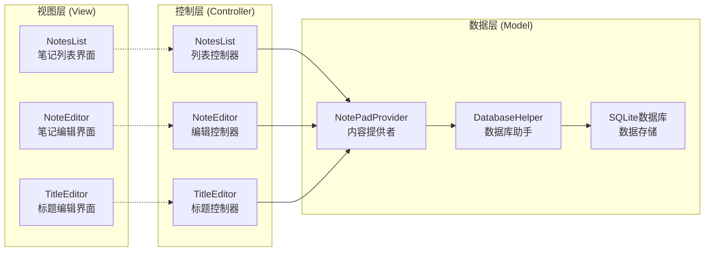
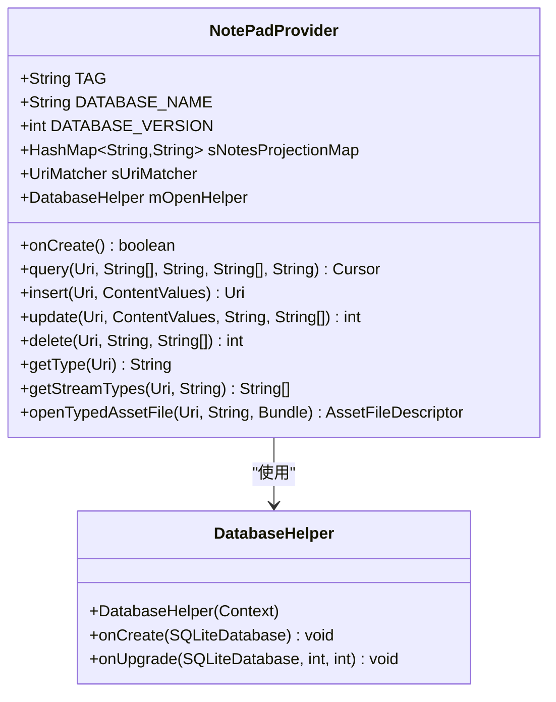
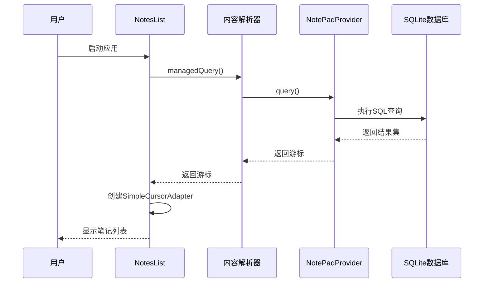
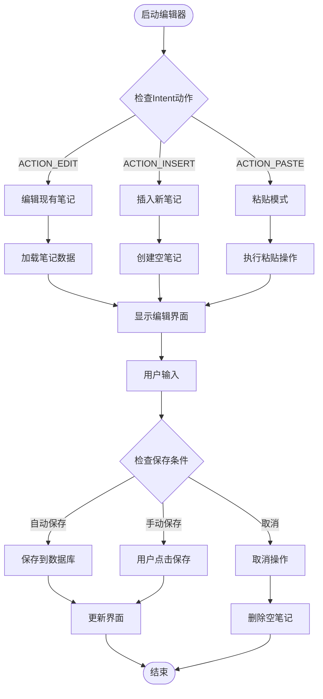

# 项目概述

<cite>
**本文档中引用的文件**
- [README.md](file://README.md)
- [NotePadProvider.java](file://app/src/main/java/com/example/android/notepad/NotePadProvider.java)
- [NotesList.java](file://app/src/main/java/com/example/android/notepad/NotesList.java)
- [NoteEditor.java](file://app/src/main/java/com/example/android/notepad/NoteEditor.java)
- [NotePad.java](file://app/src/main/java/com/example/android/notepad/NotePad.java)
- [AndroidManifest.xml](file://app/src/main/AndroidManifest.xml)
- [strings.xml](file://app/src/main/res/values/strings.xml)
- [note_editor.xml](file://app/src/main/res/layout/note_editor.xml)
- [list_options_menu.xml](file://app/src/main/res/menu/list_options_menu.xml)
- [editor_options_menu.xml](file://app/src/main/res/menu/editor_options_menu.xml)
</cite>

## 目录
1. [项目简介](#项目简介)
2. [项目结构](#项目结构)
3. [核心组件](#核心组件)
4. [架构概览](#架构概览)
5. [详细组件分析](#详细组件分析)
6. [技术栈](#技术栈)
7. [学习路径指导](#学习路径指导)
8. [总结](#总结)

## 项目简介

NotePad是一个经典的Android平台记事本应用程序，作为官方数据库操作的基本教学示例而闻名。该项目展示了如何在Android平台上构建一个完整的记事本应用，包含笔记的创建、查看、编辑、删除等核心功能，并通过Content Provider实现了数据的持久化存储。

该项目具有重要的教学价值，是Android开发学习者理解Content Provider机制、数据库操作和MVC架构模式的优秀范例。项目采用官方推荐的最佳实践，为初学者提供了清晰的学习路径，同时也为有经验的开发者展示了组件间的协作关系和数据流动机制。

**节来源**
- [README.md](file://README.md#L1-L4)

## 项目结构

NotePad项目遵循标准的Android应用结构，采用分层架构设计，将业务逻辑、数据访问和用户界面清晰分离：

**图表来源**
- [NotesList.java](file://app/src/main/java/com/example/android/notepad/NotesList.java#L1-L50)
- [NoteEditor.java](file://app/src/main/java/com/example/android/notepad/NoteEditor.java#L1-L50)
- [NotePadProvider.java](file://app/src/main/java/com/example/android/notepad/NotePadProvider.java#L1-L50)

**节来源**
- [AndroidManifest.xml](file://app/src/main/AndroidManifest.xml#L1-L119)

## 核心组件

### 数据模型定义

项目通过`NotePad`类定义了完整的数据契约，包含了所有必要的常量和URI定义：

| 组件 | 描述 | 主要属性 |
|------|------|----------|
| AUTHORITY | 提供者的权威标识 | `com.google.provider.NotePad` |
| TABLE_NAME | 数据表名称 | `notes` |
| CONTENT_URI | 内容URI基址 | `content://com.google.provider.NotePad/notes` |
| CONTENT_TYPE | 列表类型MIME | `vnd.android.cursor.dir/vnd.google.note` |
| CONTENT_ITEM_TYPE | 单项类型MIME | `vnd.android.cursor.item/vnd.google.note` |

### 数据库结构

SQLite数据库包含以下字段：
- `_ID`: 主键标识符
- `title`: 笔记标题（TEXT类型）
- `note`: 笔记内容（TEXT类型）
- `created`: 创建时间戳（INTEGER类型）
- `modified`: 修改时间戳（INTEGER类型）

**节来源**
- [NotePad.java](file://app/src/main/java/com/example/android/notepad/NotePad.java#L1-L155)
- [NotePadProvider.java](file://app/src/main/java/com/example/android/notepad/NotePadProvider.java#L194-L200)

## 架构概览

NotePad项目采用了经典的MVC（Model-View-Controller）架构模式，实现了清晰的职责分离：

**图表来源**
- [NotesList.java](file://app/src/main/java/com/example/android/notepad/NotesList.java#L54-L100)
- [NoteEditor.java](file://app/src/main/java/com/example/android/notepad/NoteEditor.java#L54-L100)
- [NotePadProvider.java](file://app/src/main/java/com/example/android/notepad/NotePadProvider.java#L54-L100)

### MVC架构详解

#### 视图层（View）
- **NotesList**: 显示笔记列表，支持上下文菜单和选项菜单
- **NoteEditor**: 提供富文本编辑功能，支持行线绘制
- **TitleEditor**: 专门用于编辑笔记标题的对话框界面

#### 控制层（Controller）
- **NotesList**: 处理列表相关的用户交互，包括点击事件、上下文菜单选择等
- **NoteEditor**: 管理笔记的创建、编辑、保存和删除操作
- **TitleEditor**: 处理标题修改请求

#### 数据层（Model）
- **NotePadProvider**: 实现Content Provider接口，提供统一的数据访问接口
- **DatabaseHelper**: 继承SQLiteOpenHelper，管理数据库的创建和版本升级

**节来源**
- [NotesList.java](file://app/src/main/java/com/example/android/notepad/NotesList.java#L54-L100)
- [NoteEditor.java](file://app/src/main/java/com/example/android/notepad/NoteEditor.java#L54-L100)
- [NotePadProvider.java](file://app/src/main/java/com/example/android/notepad/NotePadProvider.java#L54-L100)

## 详细组件分析

### NotePadProvider - 数据持久化核心

`NotePadProvider`是整个应用的数据访问层核心，实现了Android的Content Provider机制：

**图表来源**
- [NotePadProvider.java](file://app/src/main/java/com/example/android/notepad/NotePadProvider.java#L54-L100)
- [NotePadProvider.java](file://app/src/main/java/com/example/android/notepad/NotePadProvider.java#L179-L223)

#### 核心功能实现

1. **URI匹配机制**: 使用UriMatcher处理不同类型的URI请求
2. **数据库操作**: 支持CRUD（创建、读取、更新、删除）操作
3. **投影映射**: 定义列名映射关系，优化查询性能
4. **MIME类型支持**: 提供正确的MIME类型信息
5. **流式数据**: 支持将笔记内容转换为文本流

**节来源**
- [NotePadProvider.java](file://app/src/main/java/com/example/android/notepad/NotePadProvider.java#L242-L322)
- [NotePadProvider.java](file://app/src/main/java/com/example/android/notepad/NotePadProvider.java#L489-L567)

### NotesList - 笔记列表管理

`NotesList`负责显示和管理笔记列表，提供了丰富的用户交互功能：

**图表来源**
- [NotesList.java](file://app/src/main/java/com/example/android/notepad/NotesList.java#L108-L161)
- [NotePadProvider.java](file://app/src/main/java/com/example/android/notepad/NotePadProvider.java#L252-L322)

#### 关键特性

1. **列表展示**: 使用SimpleCursorAdapter显示笔记标题和修改时间
2. **上下文菜单**: 长按笔记时显示复制、删除等操作
3. **选项菜单**: 支持新建笔记和粘贴功能
4. **动态菜单**: 根据当前状态动态调整可用操作
5. **剪贴板集成**: 支持从剪贴板导入笔记内容

**节来源**
- [NotesList.java](file://app/src/main/java/com/example/android/notepad/NotesList.java#L164-L273)
- [NotesList.java](file://app/src/main/java/com/example/android/notepad/NotesList.java#L310-L451)

### NoteEditor - 笔记编辑器

`NoteEditor`提供了强大的笔记编辑功能，包括富文本编辑和行线绘制：

**图表来源**
- [NoteEditor.java](file://app/src/main/java/com/example/android/notepad/NoteEditor.java#L140-L200)
- [NoteEditor.java](file://app/src/main/java/com/example/android/notepad/NoteEditor.java#L202-L240)

#### 创新技术点

1. **自定义EditText**: `LinedEditText`类实现了行线绘制功能
2. **状态管理**: 区分编辑和插入两种状态
3. **剪贴板处理**: 智能识别和处理剪贴板内容
4. **自动保存**: 在适当时机自动保存笔记更改
5. **撤销功能**: 支持恢复到原始内容状态

**节来源**
- [NoteEditor.java](file://app/src/main/java/com/example/android/notepad/NoteEditor.java#L83-L134)
- [NoteEditor.java](file://app/src/main/java/com/example/android/notepad/NoteEditor.java#L242-L308)

## 技术栈

### 核心技术组件

| 技术组件 | 版本要求 | 用途描述 |
|----------|----------|----------|
| Java | JDK 8+ | 主要编程语言 |
| Android SDK | API Level 14+ | 平台开发框架 |
| SQLite | 内置 | 本地数据库存储 |
| Content Provider | Android Framework | 数据访问抽象层 |
| Activity Lifecycle | Android Framework | 应用生命周期管理 |

### 关键类库和组件

#### Android核心组件
- **Activity**: 应用的主要界面容器
- **ContentProvider**: 数据访问和共享机制
- **SQLiteOpenHelper**: 数据库管理辅助类
- **Cursor**: 数据查询结果集
- **Intent**: 组件间通信机制

#### 自定义组件
- **LinedEditText**: 带行线的富文本编辑器
- **DatabaseHelper**: SQLite数据库操作封装
- **NotePad**: 数据契约定义类

### 设计模式应用

1. **Content Provider模式**: 实现数据访问抽象
2. **MVC模式**: 分离关注点，提高可维护性
3. **Observer模式**: 通过ContentObserver监听数据变化
4. **Template Method模式**: Activity生命周期方法的标准化

**节来源**
- [NotePadProvider.java](file://app/src/main/java/com/example/android/notepad/NotePadProvider.java#L21-L48)
- [AndroidManifest.xml](file://app/src/main/AndroidManifest.xml#L25-L32)

## 学习路径指导

### 初学者学习路径

#### 第一阶段：基础知识准备
1. **Java编程基础**
   - 面向对象编程概念
   - 异常处理机制
   - 泛型和集合框架

2. **Android开发基础**
   - Activity生命周期
   - Intent机制
   - 资源系统（布局、菜单、字符串）
   - 权限系统

3. **数据库基础**
   - SQLite基本语法
   - 数据库设计原则
   - CURD操作

#### 第二阶段：项目深入学习
1. **理解Content Provider机制**
   - Content Provider的作用和优势
   - URI匹配和权限控制
   - 数据类型和MIME处理

2. **掌握MVC架构模式**
   - Model层的数据访问
   - View层的界面展示
   - Controller层的业务逻辑

3. **学习自定义组件开发**
   - View继承和自定义绘制
   - 事件处理机制
   - 性能优化技巧

#### 第三阶段：实践和扩展
1. **功能扩展练习**
   - 添加笔记分类功能
   - 实现笔记搜索功能
   - 添加笔记分享功能

2. **性能优化实践**
   - 数据库查询优化
   - 内存泄漏防范
   - 界面渲染优化

### 有经验开发者参考要点

#### 架构层面洞察
1. **组件解耦策略**
   - 如何实现数据层与业务层的分离
   - Content Provider作为中间层的优势
   - 接口设计的最佳实践

2. **数据流管理**
   - 从用户操作到数据持久化的完整流程
   - 异步操作的处理方式
   - 错误处理和异常恢复机制

3. **扩展性设计**
   - 如何添加新的数据类型
   - Content Provider的扩展模式
   - 插件化架构的考虑

#### 技术细节分析
1. **性能优化点**
   - 数据库连接池管理
   - 查询结果缓存策略
   - 内存使用优化

2. **安全性考虑**
   - 数据加密存储
   - 权限验证机制
   - 输入验证和清理

3. **兼容性处理**
   - 不同Android版本的适配
   - 屏幕尺寸和密度的处理
   - 权限模型的变化

**节来源**
- [NotesList.java](file://app/src/main/java/com/example/android/notepad/NotesList.java#L48-L52)
- [NoteEditor.java](file://app/src/main/java/com/example/android/notepad/NoteEditor.java#L48-L52)

## 总结

NotePad项目作为Android平台的经典教学案例，完美诠释了现代Android应用开发的最佳实践。通过这个项目，开发者可以深入理解：

### 核心价值
1. **Content Provider机制**: 学习如何构建统一的数据访问接口
2. **MVC架构模式**: 掌握清晰的代码组织和职责分离
3. **数据库操作**: 理解SQLite在Android中的实际应用
4. **用户体验设计**: 学习如何构建直观易用的应用界面

### 教学意义
- **循序渐进的学习路径**: 从简单的CRUD操作到复杂的用户交互
- **最佳实践展示**: 展示Android开发的标准做法和注意事项
- **扩展性强的设计**: 为后续功能扩展提供了良好的基础

### 实际应用价值
- **开发参考**: 为类似应用的开发提供了完整的解决方案
- **学习资源**: 适合不同水平开发者的学习和参考
- **技术验证**: 验证各种Android技术的实际效果和性能表现

通过深入学习NotePad项目，开发者不仅能够掌握具体的Android开发技能，更重要的是能够理解移动应用开发的核心思想和设计原则，为构建高质量的Android应用奠定坚实基础。